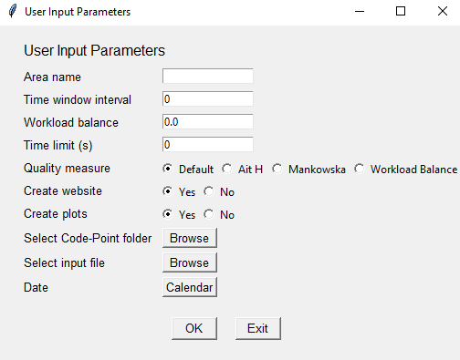

User Input Parameters
=====================

When the program is executed, a prompt will appear in which user input values can be provided for a number of parameters:

* Area name: the full name of the area to be scheduled and routed (default: Hampshire)
* Time window interval: the number of minutes before and after the expected start time of a job in which a carer can arrive and start the job (default: 15)
* Workload balance: a coefficient used to balance the workload for each carer (default: 1)
* Quality measure: the measure used to calculate the objective value (default: 'Default')
* Time limit: the desired length of time (in seconds) for the algorithm to run (default: 60)
* Create website: the creation of an html website which displays the solution on a map (default: 'Yes')
* Create plots: the creation of two plots showing the time information as a whole and the workload distribution for each carer (default: 'Yes')
* Select file: the input file containing the carer and client details (.xlsx)

The image below shows an example of the output:

